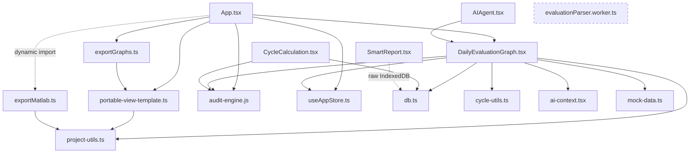

# Architecture Review — DailyEvaluationGraph Refactoring

**Project:** ESS Toolbox (Data Visualization Tool)
**Scope:** Pure refactor of `src/components/DailyEvaluationGraph.tsx` (6,146 lines) + project-wide debt audit
**Date:** 2026-07-16
**Status:** AWAITING APPROVAL — no code has been modified

---

## 1. Current Architecture

### 1.1 The component today

`DailyEvaluationGraph.tsx` is a single 6,146-line function component. Line-range map:

| Lines | Section | Size |
|---|---|---|
| 1–50 | Imports, `ActiveMetric` type, module helpers (`isBessProjectFn`, `getDefaultMetric`, `normalizeActiveMetric`, `getStatusHTML/JSX`) | 50 |
| 51–290 | Props, 6 × `useState`, 7 × `useEffect`, 4 × `useRef`, `defaultGraphConfig`, `setEvalData` fan-out write | 240 |
| 291–414 | Pure math/parsing helpers (`runAllocWithLimits`, `parseFlexDate`, `interpolateArray`, `forwardFillArray`, `findColIdx`) | 124 |
| 415–1002 | `parseEvaluationExcelFiles` — full Excel→timeseries pipeline, **runs on the main thread** | 588 |
| 1005–1230 | Upload/reuse handlers (`handleReuseValidationData`, `handleFileUpload`, `handleFolderUpload`, `handleNCCFileUpload`, `handleDownloadExcelLogs`) | 226 |
| 1232–1406 | `handleCopyClipboard` — Plotly→canvas→PNG composition | 175 |
| 1407–2977 | `handleExportHtml` — **~1,570-line inline HTML template** (portable viewer copy #1) | 1,571 |
| 2979–4597 | `handleExportAllHtml` — **~1,620-line inline HTML template** (portable viewer copy #2, ~90–95 % identical to #1) | 1,619 |
| 4604–5370 | `renderPlot` — trace builders, `applyTrace`, `applyTimeRange`, `getMATLABLayout`, 7 panel builders (`drawPanel1/2/3/PF/4/6`, `drawPanel`+`renderOverlay`) | 767 |
| 5371–6146 | Export-event effect, JSX return (two toolbar variants, dropzone with `readEntry`, metric buttons, 4-tab customization drawer) | 776 |

**Zero `useMemo`, zero `useCallback`, zero `React.memo`** in the file. `renderPlot()` is invoked unconditionally on every render (line 5795) and rebuilds every helper, every trace array, and every layout each time.

### 1.2 Responsibilities currently mixed in one file

UI (toolbar/drawer/dropzone) · state (graph config, pins, plant/metric) · Plotly trace+layout construction · Excel parsing · cycle calculation · SOC statistics · deviation timing · NCC merge · clipboard raster export · two full standalone-HTML generators · Excel log export · file-system traversal · persistence (Zustand + IndexedDB) · audit-engine integration.

### 1.3 Data flow (system level)

```
User files (xlsx/zip/rar/7z, folders, drag-drop)
        │
        ▼
parseEvaluationExcelFiles (INLINE, main thread, window.XLSX)
  · classify FVS / PQ / RemoteP / NCC / SmartLogger per file
  · fill 86,400-slot (1 Hz) arrays × ~12 signals × 3 plants
  · interpolate / forward-fill
  · cycle calc (ESS files → cycle-utils; fallback: throughput/2·capacity)
  · SOC stats + inter-plant deviation
        │
        ▼
setEvalData(data)  ──►  React state (render)
                   ──►  useAppStore.evalDataCache[project]   (in-memory)
                   ──►  IndexedDB  eval_data_${project}      (localforage)
        │
        ▼
Consumers:
  · renderPlot (this component)
  · App.tsx export handlers (read evalDataCache OR raw IndexedDB!)
      → exportMatlab.ts / exportGraphs.ts / portable-view-template.ts
  · AIAgent.tsx (via importedGraph serialization)
  · SmartReport.tsx (raw IndexedDB read)
```

Notes:
- `src/workers/evaluationParser.worker.ts` (597 lines) is a **complete orphan** — no importer anywhere. It duplicates the inline parser (same column keys, same NCC regexes, same interpolate/forwardFill).
- `cycle_history_${project}` is **written by `CycleCalculation.tsx`** and read-only consumed by DailyEvaluationGraph (line 754) — a hidden cross-component contract.
- App.tsx accesses `eval_data` both via `db.ts` (localforage) **and** via raw `indexedDB.open()` (App.tsx:132, 179, 314; SmartReport.tsx:1019) — two parallel access paths to the same data.

---

## 2. Dependency Graph

### 2.1 Import graph (verified — no import cycles exist)



`audit-engine.js` is a **leaf** (no src imports) — safe to extract from. The worker is orphaned.

### 2.2 The real coupling: shared mutable state, not imports

| Channel | Writer | Readers |
|---|---|---|
| `useAppStore.evalDataCache` | DailyEvaluationGraph (`setEvalData`, line 87) | App.tsx:168, 231, 303, 325 (export handlers) |
| `useAppStore.showNccPCommand` | DEG toggle (SNTL400/600) | App.tsx:199 (`handleExportMatlab`) |
| `useAppStore.auditStateVersion` | audit-engine flows | DEG reload effect (279–288), others |
| IndexedDB `eval_data_${project}` | DEG | DEG, App.tsx (raw IDB), SmartReport.tsx (raw IDB) |
| IndexedDB `cycle_history_${project}` | CycleCalculation.tsx | DEG:754, CycleCalculation |
| `hcByProject` (module global) | audit-engine ingest | DEG:1006, App, CycleCalculation, PlantBreakdownCards, ValidationDebug, kpi-utils |
| `localStorage ess_graph_config` | **NOBODY** (dead key — see Section 10, bug B1) | App.tsx:408, exportGraphs.ts:37, exportMatlab.ts:20 |
| `window.XLSX`, `window.Plotly`, `window.fflate` | index.html CDN tags | DEG, audit-engine, exportGraphs, worker |
| DOM CustomEvents `export-html-single/all`, `window.isGraphMounted` | App.tsx dispatches | DEG effect (5371–5386) |

### 2.3 Hook dependency map (DEG internal)

| Hook | Deps | Purpose | Issue |
|---|---|---|---|
| useEffect 236–247 | `[]` | manual double-click detection (mousedown) | ✅ has cleanup |
| useEffect 249–262 | `[isAIAgentMode, activeMetric, selectedPlant, graphConfig, pinnedPoints]` | sync UI state → `importedGraph` (AI mode) | fires every config keystroke |
| useEffect 265 | `[activeMetric, selectedPlant]` | clear pins | — |
| useEffect 272–276 | `[project, selectedPlant]` | force plant3→plant1 for SNTL400 | — |
| useEffect 279–288 | `[project, auditStateVersion]` | async DB load of `eval_data_${project}` | ⚠ no cancellation → stale-write race |
| useEffect 5371–5386 | `[]` + `exportRefs` ref | export CustomEvent listeners, `window.isGraphMounted` | ref-pattern OK; global flag smell |

### 2.4 Function → target-layer map (extraction inventory)

**Pure functions → `utils/`** (no React deps; move verbatim):
`interpolateArray` (356), `forwardFillArray` (388), `findColIdx` (409), `parseFlexDate` (345), `getDailyCycleFromP` (690), `getSocStats` (872), `getDeviationData` (933), `formatDev` (971), `runAllocWithLimits` (291 — currently **unused**), `isBessProjectFn` (28), `getDefaultMetric` (30), `normalizeActiveMetric` (33), `getStatusHTML/JSX` (39/45), `formatFullTime` (4656), `getCycleAnnotations` (4783), `getVTraces` (4619), `applyTrace` (4705), `applyTimeRange` (4674), `getMATLABLayout` (4799), `plotCfgZoom` (4913).

**Stateful logic → `hooks/`**:
eval-data lifecycle + persistence (`setEvalData`, DB-load effect) → `useEvalData`; `graphConfig`+`updateConfig`+`resetConfig`+`configTab` → `useGraphConfig`; `pinnedPoints`+hover/relayout/annotation/double-click handlers → `usePinnedPoints`; plant/metric selection incl. AI-mode proxying → `useSelection`; export CustomEvent bridge → `useExportEvents`; time-filter WeakMap caching → `useTimeFilter`.

**Business logic → `services/`**:
`parseEvaluationExcelFiles` (415–1002, progress via callback) → `evaluationParser.ts`; NCC merge (1071–1180) → `nccMerge.ts`; clipboard raster (1232–1406) → `clipboardExport.ts`; Excel logs (1183–1230) → `excelLogExport.ts`; both HTML exporters → delegate to unified `portable-view-template.ts`.

**UI → `components/`**:
Toolbar (2 variants), MetricSelector buttons, Dropzone (+`readEntry`), GraphPanel (the repeated 280 px `<Plot>` wrapper — duplicated 6+×), per-metric panels (P/F, P/SOC, V/Q, PF stack, Fig4 stack, Fig5+overlay, Fig6), CustomizationDrawer with LayoutTab/AxesTab/LinesTab/TimeTab, ProgressBar/ErrorBanner, StatsOverlay (fig5 `renderOverlay`).

---

## 3. Refactoring Strategy

**Principle: move, don't rewrite.** Every extraction is cut-paste + explicit parameters replacing closure capture. Behavior contract is enforced by:

1. **Baseline snapshots before Phase 2** — with a fixed sample dataset, capture: (a) `JSON.stringify(evalData)` after parsing, (b) the generated single/all HTML export strings, (c) generated MATLAB `.m` scripts, (d) Plotly trace/layout objects per metric (JSON dump via a temporary debug hook). After every phase, regenerate and diff. Byte-identical = pass.
2. **Compile gate** — `npx tsc --noEmit` after every phase. ⚠ Baseline is currently **3 errors** (see Section 10, B0); Phase 0 fixes these so the gate is meaningful.
3. **One extraction target per commit** — trivially revertible.
4. **No behavior "fixes" without approval** — bugs found (Section 10) are documented, not silently fixed; fixing them mid-refactor would violate the byte-identical contract.

**Special handling — the triple-copy HTML viewer:** the two inline templates and `portable-view-template.ts` differ subtly (metric switcher, 2 CSS rules, plant badge, SNTL cmd/remote blanking, config source). Unification parameterizes ONE template with flags (`mode: 'single' | 'all'`, `withSwitcher`, `plantBadge`, injected config object) and must reproduce each variant's current output byte-for-byte (whitespace-tolerant diff acceptable if DOM-equivalent; strict target is byte-identical). This is Phase 9 — last and riskiest, gated by the snapshot diffs.

---

## 4. Proposed Folder Structure

```
src/features/daily-evaluation/
├── index.tsx                       # container: composes hooks + components (~300 lines)
├── components/
│   ├── Toolbar.tsx                 # normal + AI/export-preview variants
│   ├── MetricSelector.tsx          # left-column mode buttons (BESS vs PF sets)
│   ├── Dropzone.tsx                # drag-drop + readEntry traversal + file/folder/NCC inputs
│   ├── GraphPanel.tsx              # shared <Plot> wrapper (280px, events, config)
│   ├── panels/
│   │   ├── PanelFP.tsx             # f_p        (drawPanel1)
│   │   ├── PanelSocP.tsx           # soc_p      (drawPanel2)
│   │   ├── PanelVQ.tsx             # v_q, fig6  (drawPanel3/6)
│   │   ├── PanelPFStack.tsx        # pf_p1/2/3  (drawPanelPF)
│   │   ├── PanelFig4.tsx           # fig4       (drawPanel4)
│   │   └── PanelFig5.tsx           # fig5 + StatsOverlay (drawPanel/renderOverlay)
│   ├── StatsOverlay.tsx            # DraggableOverlay stat boxes
│   ├── CustomizationDrawer/
│   │   ├── index.tsx
│   │   ├── LayoutTab.tsx / AxesTab.tsx / LinesTab.tsx / TimeTab.tsx
│   └── ProgressIndicator.tsx       # calc progress + error banner
├── hooks/
│   ├── useEvalData.ts              # state + zustand + IndexedDB fan-out, DB reload (w/ cancellation guard*)
│   ├── useGraphConfig.ts           # graphConfig/updateConfig/resetConfig/configTab
│   ├── useSelection.ts             # plant + metric, AI-mode external proxying
│   ├── usePinnedPoints.ts          # pins, hover/relayout/annotation/dblclick
│   ├── useTimeFilter.ts            # applyTimeRange WeakMap caching
│   └── useExportEvents.ts          # export-html-single/all CustomEvent bridge
├── services/
│   ├── evaluationParser.ts         # parseEvaluationExcelFiles (progress-callback API)
│   ├── nccMerge.ts                 # NCC/EMS file merge
│   ├── clipboardExport.ts          # Plotly→canvas→PNG clipboard
│   ├── excelLogExport.ts           # Message/Realtime_Dispatch workbook
│   └── htmlExport.ts               # thin orchestrator → shared portable-view template
├── utils/
│   ├── interpolation.ts            # interpolateArray, forwardFillArray
│   ├── columnMatching.ts           # findColIdx, classification regexes (single source w/ worker)
│   ├── cycleFromPower.ts           # getDailyCycleFromP
│   ├── socStats.ts                 # getSocStats, getDeviationData, formatDev
│   ├── allocation.ts               # runAllocWithLimits (currently unused — kept per no-delete rule)
│   ├── formatters.ts               # formatFullTime, formatDev, parseFlexDate, status labels
│   ├── traceBuilders.ts            # getVTraces, applyTrace, getCycleAnnotations
│   └── layoutBuilders.ts           # getMATLABLayout, plotCfgZoom
├── config/
│   ├── defaultGraphConfig.ts       # the 104–138 default object
│   ├── metricConfig.ts             # ActiveMetric, getDefaultMetric, normalizeActiveMetric, labels
│   └── traceIndexMap.ts            # documents the per-panel trace-index → Lines-tab mapping
└── types/
    ├── evalData.ts                 # EvalData, PlantKey, PlantSeries (adopted incrementally)
    ├── graphConfig.ts              # GraphConfig
    └── export.ts                   # portable-view options
```

**Shared (project-wide) additions:**

```
src/lib/project-detection.ts        # isBessProject / is20PercentProject — single source (~30 dup sites)
src/lib/date-helpers.ts             # _MON, _validDate, extractDataDate, parseFlexDate
src/lib/ai-config.ts                # single GEMINI_MODEL source (5 hardcoded sites today)
src/types/eval-data.ts              # shared EvalData type (DEG, store, App, exporters)
```

Old import path preserved during migration: `src/components/DailyEvaluationGraph.tsx` becomes a one-line re-export until Phase 10 updates the 2 call sites (App.tsx:755, 909; AIAgent.tsx:617).

\* the cancellation guard is a bug fix (Section 10, B4) — applied only with your approval, otherwise moved verbatim.

---

## 5. Risk Analysis

| # | Risk | Severity | Mitigation |
|---|---|---|---|
| R1 | HTML-template unification changes exported-file bytes (3 divergent copies with real differences) | **HIGH** | Do last (Phase 9); snapshot string diff per variant per project type (BESS / SNTL400 / 3-plant); keep flags for every observed difference |
| R2 | Trace-index coupling breaks Lines-tab behavior (indices are inconsistent by design: soc_p uses 10/11/3/4/5; v_q 3/10/4; voltage traces share idx 0; fig5 maps by position) | **HIGH** | `traceIndexMap.ts` documents current mapping verbatim; NO normalization; snapshot trace JSON per metric |
| R3 | Closure-capture extraction introduces stale values (helpers silently depend on `graphConfig`, `evalData`, `project`, `showNccPCommand`) | MED | Explicit parameter objects; TypeScript makes missed captures compile errors |
| R4 | Memoization changes behavior (e.g., a mutation of `evalData` arrays currently "works" because everything rebuilds) — NCC merge mutates cloned arrays, fig5 post-hoc `applyTrace` | MED | Memoize only after extraction is verified; key on the exact values previously closed over; NCC merge already clones — verify no other in-place mutation first |
| R5 | The `importedGraph` sync effect (249–262) — AI mode depends on exact object identity/timing | MED | Keep effect shape and dep list identical in `useSelection`/`useGraphConfig` composition |
| R6 | Deleting ImportMatCodePage breaks something unseen | LOW | Verified: only importers are App.tsx:62 and PowerFlowMode.tsx:53, neither renders it; tsc gate confirms |
| R7 | Circular imports introduced by new layers | LOW | Enforce direction: types ← config ← utils ← services ← hooks ← components ← index; utils never import hooks/components |
| R8 | Worker adoption changes parse timing/ordering | — | **Out of scope**; recorded as opt-in future work (Section 7, P6) |

---

## 6. Migration Order (phase plan, compile + snapshot gate after each)

| Phase | Content | Output | Risk |
|---|---|---|---|
| **0. Baseline** | Fix 3 pre-existing tsc errors (declare `window.DEBUG_EVAL_DATA`; remove dead ImportMatCodePage chain **after your confirmation**; add `webworker` lib for worker's `importScripts`); capture snapshots (Section 3.1) | Green `tsc`, snapshot fixtures | Low |
| **1. Audit** | ✅ this document | — | — |
| **2. Shared types** | `types/evalData.ts`, `graphConfig.ts`, `metric.ts`; type the store's `evalDataCache` | Types only, no logic moves | Low |
| **3. Utilities** | Move the 20 pure functions (Section 2.4) verbatim; DEG imports them | ~8 util files, DEG −~700 lines | Low |
| **4. Constants/config** | `defaultGraphConfig.ts`, `metricConfig.ts`, `traceIndexMap.ts`; shared `project-detection.ts` + `date-helpers.ts`, swap ~30 duplicate sites | DEG −~150; project-wide dedup | Low-Med |
| **5. Services** | `evaluationParser.ts` (progress callback), `nccMerge.ts`, `clipboardExport.ts`, `excelLogExport.ts` | DEG −~1,000 | Med (R3) |
| **6. Hooks** | `useEvalData`, `useGraphConfig`, `useSelection`, `usePinnedPoints`, `useTimeFilter`, `useExportEvents` | DEG −~300 | Med (R5) |
| **7. Reusable components** | Toolbar, MetricSelector, Dropzone, CustomizationDrawer(+4 tabs), ProgressIndicator, StatsOverlay | DEG −~600 | Med |
| **8. Graph rendering** | GraphPanel + 6 panel components + traceBuilders/layoutBuilders wiring; retire `renderPlot` | DEG −~750 | **High** (R2) — snapshot trace/layout JSON |
| **9. Export module** | Unify 3 HTML-viewer copies into parameterized `portable-view-template.ts`; `htmlExport.ts` orchestrator | DEG −~3,190; delete ~1,400 dup lines in lib | **High** (R1) — byte-diff gate |
| **10. Cleanup** | Move file to `features/daily-evaluation/index.tsx`, update 3 render sites, delete re-export shim; scratch-file cleanup + `.gitignore` (after confirmation); final `tsc` + manual regression pass (per project type: BESS, SNTL400, 3-plant) | ~350-line container | Low |

Each phase = 1–3 commits. The app compiles and behaves identically at every commit boundary.

---

## 7. Performance Recommendations (behavior-identical)

| # | Change | Where | Expected effect |
|---|---|---|---|
| P1 | `useMemo` the per-metric panel output keyed on `[evalData, graphConfig, activeMetric, selectedPlant, pinnedPoints, showNccPCommand, theme]` | Phase 8 panels | Eliminates full trace-rebuild on unrelated renders (hover, drawer typing) |
| P2 | `useCallback` on all handlers passed to child components + `React.memo` on GraphPanel, Toolbar, drawer tabs | Phases 7–8 | Stops child re-renders from parent state churn |
| P3 | Keep/extend the existing WeakMap time-filter cache in `useTimeFilter`; add memoized `timeX` HH:MM:SS mapping (currently re-mapped per render) | Phase 6 | Removes 86k-element string mapping per render |
| P4 | Precompute per-plant "hasData" flags once per `evalData` (currently `some(!isNaN)` scans repeated in 6 panel builders per render) | Phase 8 | Removes ~15 full-array scans per render |
| P5 | Lazy-load export services (`htmlExport`, `clipboardExport`, `excelLogExport`) via dynamic `import()` — matches App.tsx's existing pattern for exportMatlab | Phase 9 | Smaller initial chunk; template strings (~120 KB) leave the main bundle |
| P6 | **Opt-in, later:** wire the orphaned `evaluationParser.worker.ts` back in so parsing leaves the main thread (it exists for exactly this) | Post-refactor | UI stays responsive during multi-file parse — *behavior-affecting (async timing), requires explicit approval* |
| P7 | Dead-weight check: `runAllocWithLimits` and metric `f_p` are unreachable from the UI — flagged for your decision, kept by default per no-delete rule | Phase 10 | — |

Bundle note: `plotly.js/dist/plotly.js` full bundle is imported (line 3–4); switching to `plotly.js-dist-min` or a partial bundle is a possible ~2–3 MB saving but must be verified against every trace type used — deferred to post-refactor.

---

## 8. Estimated New Files

~38 new files (feature folder: 6 components + 6 panels + 5 drawer files + 6 hooks + 5 services + 8 utils + 3 config + 3 types) + 4 shared lib/type files. All ≤ ~450 lines; most ≤ 200.

## 9. Estimated Complexity Reduction

| Metric | Before | After |
|---|---|---|
| DailyEvaluationGraph.tsx | 6,146 lines, 1 file | ~350-line container + ~38 focused modules |
| Portable HTML viewer | 3 copies ≈ 4,600 lines | 1 parameterized template ≈ 1,500 lines (**−~3,100 lines**) |
| Largest single file in feature | 6,146 | ≤ ~450 |
| `any` on core data | everywhere | `EvalData` typed end-to-end (DEG, store, App, exporters) |
| Duplicate project-prefix checks | ~30 sites, 2 divergent variants | 1 shared util |
| Testability | none (all closures) | 20+ pure functions unit-testable |

## 10. Potential Bugs Discovered (documented, NOT fixed without approval)

| # | Bug | Location | Impact |
|---|---|---|---|
| B0 | **Build currently fails `tsc`** — 3 errors: missing `ImportMatCode.tsx` (deleted file still imported), `window.DEBUG_EVAL_DATA` untyped, `importScripts` unknown in worker | ImportMatCodePage.tsx:2, DEG:1172, worker:80 | No clean compile gate |
| B1 | `localStorage 'ess_graph_config'` is read by App.tsx:408, exportGraphs.ts:37, exportMatlab.ts:20 but **never written anywhere** — the exporters' style-override path is dead; exported styling can disagree with on-screen config (which lives only in React state) | lib + App | Export style drift |
| B2 | `getDailyCycleFromP` fallback uses `Math.random()` → **non-deterministic cycle numbers** in reports | DEG:699 | Data integrity |
| B3 | Excel log export uses truthy checks — legitimate `0 MW` values exported as missing; `dispatchP` referenced but never populated by the parser | DEG:1206–1207 | Wrong export values |
| B4 | DB-load effect has no cancellation — fast project switching can commit stale `evalData` | DEG:279–288 | Race condition |
| B5 | fig5 uses **unfiltered** `timeX` — the Time-tab range filter silently doesn't apply to fig5 | DEG:5141+ | Feature inconsistency |
| B6 | Metric `f_p` is implemented but unreachable (no UI control emits it); `runAllocWithLimits` never called | DEG:4923/291 | Dead paths |
| B7 | `isNaN(null) === false` — several `some(v => !isNaN(v))` guards count `null` as valid data | DEG:4925 etc. | Phantom plants |
| B8 | Export save: non-Abort errors after `showSaveFilePicker` are swallowed; anchor fallback never reached | DEG:2963/4583 | Silent export failure |
| B9 | Two BESS-detection variants disagree (`startsWith` set vs `includes('BESS')||'SNTB30MWH'`) | DEG:28 vs 781; worker:402 | Divergent classification |
| B10 | `uirevision` fallback omits `dataResolution` → changing resolution doesn't reset zoom | DEG:4838 | Minor UX |
| B11 | Time filter `toSeconds` assumes exactly 1 sample/sec — wrong slicing for gapped data | DEG:4682 | Filter accuracy |
| B12 | Same store, two access paths: localforage (`db.ts`) vs raw `indexedDB.open()` in App.tsx/SmartReport | App:132/179/314, SmartReport:1019 | Consistency risk |
| B13 | Hardcoded `'gemini-3-flash-preview'` in 5 files ignores the user-selected `aiModelTier` (`gemini-2.5-pro` default, SettingsWindow offers 2.5-pro/flash) | ai-context.tsx:91, AIAgent.tsx:283, powerflow ×2, ImportChartScript:452 | Settings do nothing |

**Recommended disposition:** B0 fixed in Phase 0 (compile gate). B13: create `lib/ai-config.ts` exporting the *currently used* model (`gemini-3-flash-preview`) so behavior is unchanged, then optionally wire the store tier as a follow-up decision. All others: fix only after the refactor completes, as separate approved commits.

## 11. Technical Debt Report (project-wide)

1. **Orphan/dead code:** `evaluationParser.worker.ts` (597 lines, never imported); `PowerFlowMode.tsx` (2,059 lines, never rendered); `ImportMatCodePage.tsx` (imports a deleted file); `MatFigExportPage` passes `result={null}`; `f_p` metric; `runAllocWithLimits`; `src/replace.cjs` one-off codemod.
2. **Root scratch files** (untracked): `Data.zip` (~1 GB), `diff.txt` (1 MB), `test-export.{ts,m,html}`, `test.html`, `test_output.html`, `test_gen.ts`, `test_script.ts`, `test_parser_extract.txt` — recommend delete + `.gitignore` entries (Phase 10, after your confirmation).
3. **Duplicate logic:** project-prefix detection ~30 sites; date helpers ×4 copies (audit-engine, powerflow-audit-engine, worker, DEG); parser logic ×2 (DEG inline vs worker); portable viewer ×3; `powerflow-audit-engine.js` is a near-copy of `audit-engine.js` (its own comment admits "mimicking ess20-engine.ts"); `drawInfoBox`/`getStatus` duplicated in clipboard + both HTML templates.
4. **Architecture smells:** core data flows through module-global mutable state (`hcByProject`) with a version-counter render bridge; CDN globals (`window.XLSX/Plotly/fflate`) instead of imports; giant inline template literals; no shared types for the core data structure; audit-engine manipulates DOM by id from a non-React module.
5. **Other giants for future phases:** `defaultTools.ts` (4,647), `ESS20Tool.tsx` (4,357), `SmartReport.tsx` (3,258), `audit-engine.js` (2,288), `App.tsx` (1,189).

## 12. Final Implementation Roadmap

```
Phase 0  Baseline: fix 3 tsc errors, remove ImportMatCodePage chain*, capture snapshots     (~½ day)
Phase 2  Shared types (EvalData, GraphConfig, ActiveMetric)                                 (~½ day)
Phase 3  Extract 20 pure utils                                                              (~1 day)
Phase 4  Config/constants + shared project-detection & date-helpers dedup                   (~1 day)
Phase 5  Services: parser, NCC merge, clipboard, Excel logs                                 (~1–2 days)
Phase 6  Hooks: useEvalData, useGraphConfig, useSelection, usePinnedPoints, useTimeFilter,
         useExportEvents                                                                    (~1–2 days)
Phase 7  Components: Toolbar, MetricSelector, Dropzone, CustomizationDrawer, overlays       (~1–2 days)
Phase 8  Graph rendering: GraphPanel + 6 panels + memoization (P1–P4)                       (~2 days, high care)
Phase 9  Export unification: 3 viewer copies → 1 parameterized template (byte-diff gated)   (~2 days, high care)
Phase 10 Relocate to features/, update 3 call sites, scratch cleanup*, regression pass      (~½ day)
                                                                     * = needs your explicit OK
```

Gates at every phase: `npx tsc --noEmit` green · snapshot diffs byte-identical · app boots and renders each metric for BESS / SNTL400 / 3-plant sample projects.

**Out of scope until separately approved:** bug fixes B1–B12, worker adoption (P6), Plotly bundle slimming, PowerFlow-module consolidation, defaultTools/SmartReport/ESS20Tool decomposition.
